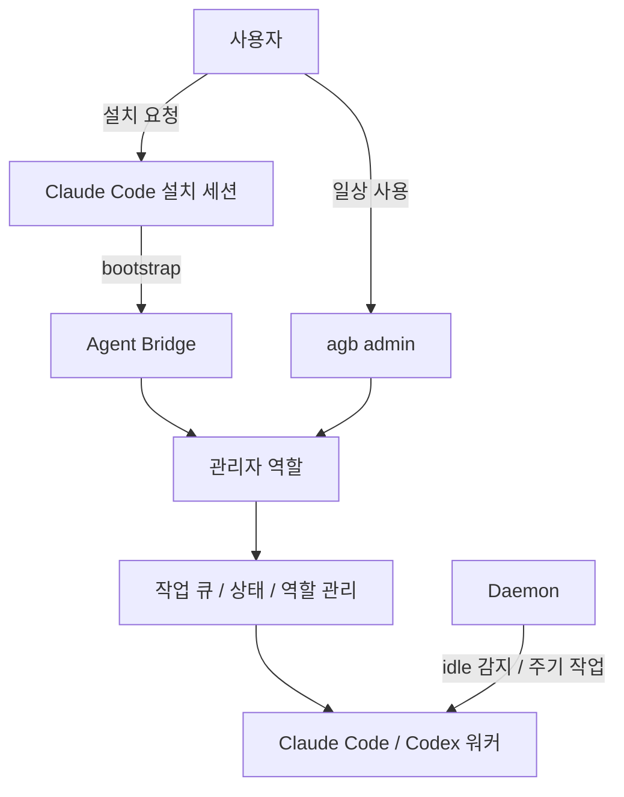

# Agent Bridge

[](https://github.com/SYRS-AI/agent-bridge/actions/workflows/ci.yml)
[](./LICENSE)

Agent Bridge는 Claude Code와 Codex를 함께 운영하기 위한 `tmux` 기반 로컬 orchestration layer입니다. 핵심 UX는 단순합니다. 사람은 관리자 에이전트에게 자연어로 요청하고, 에이전트 실행, 작업 큐 전달, 상태 확인, worktree 분리, 채널 온보딩 같은 운영 작업은 Agent Bridge가 맡습니다.

이 프로젝트는 신뢰된 로컬 작업 환경을 전제로 합니다. 즉, Claude Code 또는 Codex에게 현재 디렉토리 접근 권한을 의도적으로 주는 흐름을 기본 가정으로 합니다.

> 대부분의 사용자는 설치 후 `agb admin`만 알면 충분합니다.

## 한눈에 보기



## 이 프로젝트가 푸는 문제

- Claude Code와 Codex를 같은 로컬 환경에서 같이 굴리고 싶다.
- 여러 에이전트에게 일을 나눠주되, 누가 무엇을 처리 중인지 한눈에 보고 싶다.
- 일반 작업은 큐로 안전하게 넘기고, 진짜 급할 때만 인터럽트하고 싶다.
- 같은 저장소에서 동시에 여러 에이전트가 수정해야 할 때 충돌을 줄이고 싶다.
- 설치와 운영은 가능하면 사람 대신 관리자 에이전트가 맡았으면 좋겠다.

## 기본 원칙

- 사람은 저수준 명령보다 `agb admin`과 자연어 요청을 우선합니다.
- 일반 협업은 queue-first로 처리합니다.
- 긴급 인터럽트는 예외 상황에만 씁니다.
- 같은 저장소에서 동시 쓰기가 필요하면 worktree를 분리합니다.
- 새 설치는 비어 있는 정적 역할에서 시작하고, bootstrap이 관리자 역할부터 만듭니다.

## 설치 방법

### 권장: Claude Code에게 설치 맡기기

가장 권장하는 방식은 Claude Code에게 이 저장소 설치를 맡기는 것입니다. 목표는 설치가 끝난 뒤 사람이 `agb admin`만 실행하면 되도록 만드는 것입니다.

Claude Code에게 아래처럼 요청하면 됩니다.

```text
https://github.com/SYRS-AI/agent-bridge 를 설치해줘.

README를 읽고 AI-native bootstrap 흐름으로 진행해.
실행 전에 OS와 필수 도구를 점검해.

macOS라면:
- Homebrew가 없으면 먼저 설치해
- bash, tmux, python3, git, shellcheck를 설치하거나 업그레이드해
- PATH에서 Homebrew bin이 먼저 오게 해
- `bash --version`이 4 이상이 아니면 진행하지 마

Linux라면:
- bash, tmux, python3, git, shellcheck를 패키지 매니저로 준비해

관리자 역할은 Claude Code 기반으로 하나 만들어줘.
shell integration, bootstrap, daemon setup까지 마치고 마지막 안내는 `agb admin`만 남겨줘.

Telegram 또는 Discord 자격 증명이 없으면 초보자도 따라할 수 있게 단계별로 설명한 뒤 설치를 이어가.
토큰, 채널 ID, 로그인 승인, 2FA가 필요한 경우를 제외하면 내가 bridge 하위 명령을 직접 입력하지 않게 해줘.
```

설치가 끝나면 보통 순서는 이렇습니다.

1. 설치용 Claude Code 세션을 닫습니다.
2. 현재 셸이 아직 갱신되지 않았다면 새 셸을 엽니다.
3. `agb admin`을 실행합니다.

### 수동 설치

직접 설치해야 한다면, 저수준 `bridge-*.sh`를 조합하지 말고 `bootstrap` 하나로 끝내는 방향을 권장합니다.

필수 요구 사항:

- Bash 4+
- `tmux`
- `python3`
- `git`
- 최소 하나의 에이전트 CLI
- `claude` 또는 `codex`

macOS에서는 기본 `/bin/bash`가 `3.2`라서 그대로는 부족합니다. Homebrew Bash가 `PATH` 앞에 오도록 먼저 맞춰야 합니다.

macOS 예시:

```bash
brew install bash tmux python shellcheck git
echo 'export PATH="$(brew --prefix)/bin:$PATH"' >> ~/.zshrc
exec zsh
bash --version
```

Linux 예시:

```bash
sudo apt update
sudo apt install -y bash tmux python3 shellcheck git
bash --version
```

그 다음 저장소를 가져오고 bootstrap을 실행합니다.

```bash
gh repo clone SYRS-AI/agent-bridge ~/agent-bridge
cd ~/agent-bridge
./agb bootstrap --admin manager --engine claude
```

`gh`가 없다면:

```bash
git clone https://github.com/SYRS-AI/agent-bridge.git ~/agent-bridge
cd ~/agent-bridge
./agb bootstrap --admin manager --engine claude
```

설치 계획만 먼저 보고 싶다면:

```bash
./agb bootstrap --admin manager --engine claude --dry-run --json
```

bootstrap은 shell integration, 관리자 역할 생성, daemon setup, 지원되는 macOS 환경의 LaunchAgent 등록까지 함께 처리합니다. 설치 후에는 새 셸을 열고 `agb admin`으로 들어가면 됩니다.

## 일상 사용법

### 사람 기준 기본 흐름

사람이 기억해야 하는 핵심 명령은 사실상 이것 하나입니다.

```bash
agb admin
```

이후에는 관리자 에이전트에게 자연어로 요청하면 됩니다. 예시:

- "현재 열려 있는 에이전트와 대기 중인 작업을 보여줘."
- "Codex 워커 하나 더 띄워서 이 리포 작업 분산해줘."
- "이 수정 사항을 tester에게 큐로 넘기고 재확인 받게 해줘."
- "동시 편집 충돌이 나지 않게 worktree로 별도 워커를 만들어줘."
- "Telegram 연결까지 마저 진행해줘."
- "업데이트 가능한지 확인하고 필요하면 브리지 업그레이드해줘."

### 사람이 직접 쓸 최소 명령

운영 중에 사람이 직접 칠 가능성이 있는 명령은 보통 이 정도면 충분합니다.

```bash
agb admin
agb status
agb list
agb upgrade --pull --restart-daemon
```

설명:

- `agb admin`: 관리자 역할에 붙습니다.
- `agb status`: 전체 상태 대시보드를 봅니다.
- `agb list`: 현재 활성 에이전트를 간단히 봅니다.
- `agb upgrade --pull --restart-daemon`: 저장소 기준 최신 코드로 라이브 설치를 갱신합니다.

### 사람이 굳이 외울 필요 없는 것

CLI 표면은 넓지만, 다음 명령은 주로 관리자 에이전트나 유지보수자가 다룹니다.

- `agb task ...`
- `agb setup ...`
- `agb cron ...`
- `agb memory ...`
- `agb profile ...`
- `agb agent ...`
- 저장소 루트의 `bridge-*.sh` 스크립트들

README도 의도적으로 이 명령들을 사람용 주 흐름으로 밀지 않습니다. 보통은 `agb admin`으로 들어가 자연어로 부탁하는 편이 맞습니다.

## 주요 기능

### 1. 관리자 에이전트 중심 운영

bootstrap은 먼저 장기 실행용 관리자 역할을 만듭니다. 설치가 끝난 뒤 사람은 관리자 에이전트에게 자연어로 요청하고, 관리자 에이전트가 나머지 역할 생성과 운영을 이어받습니다.

### 2. Queue-first 협업

일반 작업 전달은 durable SQLite task queue를 중심으로 처리합니다. 작업 생성, 확인, claim, 완료, handoff가 모두 큐를 중심으로 돌아가며, `tmux` 세션이 꺼졌다 켜져도 상태를 유지합니다.

### 3. 정적 역할과 동적 에이전트

- 정적 역할은 장기 운영용 이름 있는 역할입니다.
- 동적 에이전트는 현재 디렉토리에서 즉시 띄우는 온디맨드 워커입니다.

새 설치는 정적 역할이 비어 있는 상태에서 시작합니다. 필요할 때 관리자 역할이 장기 역할을 추가하거나, 즉석 워커를 띄우는 식으로 운영하면 됩니다.

### 4. 상태 대시보드와 daemon

`agb status`는 큐 적체, 활성 세션, stale 상태 같은 운영 정보를 한 번에 보여줍니다. daemon은 live roster 동기화, heartbeat, idle 에이전트 nudge, 반복 작업 처리 같은 배경 동작을 맡습니다.

일반 사용자는 daemon을 직접 만지기보다 bootstrap과 관리자 에이전트에 맡기는 흐름을 권장합니다.

### 5. Git worktree 격리

같은 저장소에서 여러 에이전트가 동시에 수정해야 하면 worktree 기반 격리 워커를 만들 수 있습니다. 공유 체크아웃 하나를 억지로 같이 쓰는 것보다 안전하고, 충돌 가능성을 줄이기 좋습니다.

### 6. 채널 연동

Telegram, Discord 같은 채널 연동을 지원합니다. 다만 이 README는 사람이 `setup` 하위 명령을 외우도록 설계하지 않습니다. 설치나 온보딩이 필요하면 관리자 에이전트에게 맡기는 흐름을 기본으로 둡니다.

### 7. Cron과 Memory

반복 작업과 메모리 위키/검색도 포함되어 있습니다. 다만 이 둘은 운영 자동화나 고급 워크플로우에 가까운 기능입니다. 대부분의 사용자는 직접 명령을 치기보다 관리자 에이전트에게 "이 작업을 매일 돌려줘" 또는 "이 선호를 기억해줘"라고 말하는 쪽이 자연스럽습니다.

## 전제와 보안

- Agent Bridge는 trusted local project 전용입니다.
- 에이전트에게 현재 디렉토리 접근을 의도적으로 주는 상황을 가정합니다.
- 멀티테넌트 서버 오케스트레이션이나 미승인 원격 환경 제어를 목표로 하지 않습니다.

## 프로젝트 구성

- `agb`: 짧은 사용자 진입점
- `agent-bridge`: 전체 CLI 엔트리포인트
- `lib/`: 공용 Bash 구현
- `bridge-queue.py`: 큐와 daemon 측 상태 저장
- `agents/_template/`: 공개용 장기 역할 템플릿
- `shared/`: 사람이나 에이전트가 넘겨보는 handoff 메모
- `state/`, `logs/`: 런타임 산출물

공개 저장소는 private agent profile을 그대로 싣지 않습니다. 장기 역할 프로필은 템플릿을 기반으로 별도 로컬 환경이나 private companion repo에서 관리하는 흐름을 권장합니다.

## 추가 문서

- [ARCHITECTURE.md](./ARCHITECTURE.md)
- [OPERATIONS.md](./OPERATIONS.md)
- [KNOWN_ISSUES.md](./KNOWN_ISSUES.md)
- [agents/README.md](./agents/README.md)
- [CONTRIBUTING.md](./CONTRIBUTING.md)
- [SECURITY.md](./SECURITY.md)

## 라이선스

[MIT](./LICENSE)
