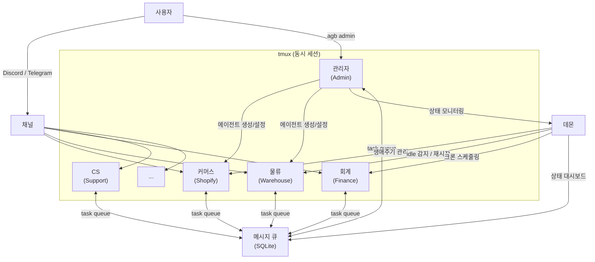

# Agent Bridge

[](https://github.com/SYRS-AI/agent-bridge/actions/workflows/ci.yml)
[](./LICENSE)

**AI 에이전트 팀을 만들어서 회사 업무를 자동화하세요.**

Agent Bridge는 Claude Code와 Codex 같은 AI 코딩 에이전트를 "직원"처럼 여러 명 동시에 띄워서, 각자 맡은 업무를 수행하게 하는 로컬 오케스트레이션 플랫폼입니다.

> 5명이 할 일을 에이전트 20명이 대신합니다.
> 설정부터 유지보수까지 전부 자연어로.

---

## 실제 사용 사례

일본에서 D2C 브랜드를 운영하는 1인 스타트업이 Agent Bridge로 20개 이상의 에이전트를 운영하고 있습니다:

- **커머스 에이전트** — Shopify 주문 처리, 재고 관리, 테마 배포
- **물류 에이전트** — 3PL 창고 배송 추적, 포장 지시, 주문 상태 모니터링
- **회계 에이전트** — 회계 시스템 연동, 거래 분류, 세금계산서 관리
- **광고 에이전트** — Facebook/Instagram 광고 성과 모니터링, 예산 추적
- **CS 에이전트** — 고객 문의 응대, 리뷰 모니터링
- **마케팅 에이전트** — 리뷰 분석, 인플루언서 시딩 관리
- **비서 에이전트** — 대표의 일정, 이메일, 브리핑, 저녁 다이제스트
- **관리자 에이전트** — 시스템 전체를 관리하는 주치의

각 에이전트는 Discord 채널에 상주하며, 담당자가 채널에 말을 걸면 응답합니다. 에이전트끼리 일감을 주고받고, 문제가 생기면 사람에게 보고합니다.

**이 모든 것이 Mac mini 한 대에서 돌아갑니다.(리눅스 클라우드 서버에서도 가능)**

---

## 한눈에 보기



---

## 이 프로젝트가 풀고자 하는 문제

### 최소 인력으로 운영되는 AI 네이티브 조직

스타트업과 같은 소규모 팀이 마케팅, CS, 물류, 회계, 개발을 한두 명이 다 맡고 있다면 — 각 영역에 전문 AI 에이전트를 배치해서 사람은 의사결정에 집중할 수 있습니다.

### 구체적으로 이런 것이 가능합니다

- **24시간 고객 응대** — Discord/Telegram에 에이전트가 상주하며 고객 문의를 즉시 처리
- **자동 업무 체인** — 주문이 들어오면 Shopify 에이전트가 확인 → 물류 에이전트가 출고 지시 → 완료되면 CS 에이전트가 배송 안내
- **정기 보고** — 매일 아침 브리핑, 매주 매출 분석, 매월 결산을 크론으로 자동 생성
- **에이전트 간 협업** — 광고팀 에이전트가 "이번 주 광고비가 예산 초과"라고 보고하면 회계 에이전트가 확인하고 사람에게 알림
- **자연어 유지보수** — "커머스 에이전트한테 매일 아침 9시에 재고 리포트 보내게 해줘" → 관리자 에이전트가 크론 설정까지 처리

---

## 설계 철학

Agent Bridge는 **가능한 한 적게 만들고, 빨리 사라지는 것**이 목표입니다.

Anthropic과 OpenAI는 빠른 속도로 자사 에이전트 하네스에 기능을 추가하고 있습니다. 멀티에이전트 오케스트레이션, 메모리, 도구 연동 같은 기능이 결국 Claude Code와 Codex에 네이티브로 들어올 것입니다.

그때까지 필요한 최소한의 접착제 — 그것이 Agent Bridge입니다.

- **자체 에이전트 런타임을 만들지 않습니다.** Claude Code와 Codex가 에이전트 그 자체입니다.
- **모델 제작사의 로드맵을 따릅니다.** 자체 구현보다 업스트림 기능을 우선 사용합니다.
- **궁극적으로는 흡수될 것을 전제합니다.** Agent Bridge가 필요 없어지는 날이 오면, 그것이 성공입니다.

---

## 시작하기

### 필요한 것

- macOS 또는 Linux
- [Claude Code](https://docs.claude.com/en/docs/claude-code) 설치 (메인 에이전트 엔진)
- 선택: [Codex CLI](https://github.com/openai/codex) (보조 에이전트용)

Claude Code를 메인으로 사용하는 이유: Discord/Telegram 등 외부 채널 연결을 네이티브 플러그인으로 지원하기 때문입니다. Codex도 에이전트 엔진으로 완전히 지원하지만, 채널 연동이 필요한 에이전트에는 Claude Code를 사용합니다.

### 설치

Claude Code에게 맡기세요.

```bash
claude
```

Claude Code가 열리면 이렇게 말합니다:

```text
https://github.com/SYRS-AI/agent-bridge-public 을 설치해줘.
README를 읽고 bootstrap 해.
```

설치가 끝나면:

```bash
agb admin
```

이것만 기억하면 됩니다. 이후 모든 것은 관리자 에이전트(패치)에게 자연어로 요청하면 됩니다.

---

## Discord 연결하기

에이전트가 Discord에서 일하려면 Discord 봇이 필요합니다. 패치를 디스코드에 연결해봅니다.
1. 먼저 PC에서 디스코드를 실행하고 좌측 하단에 User Settings(기어 아이콘) -> Advanced -> Developer Mode 를 On 해주세요.
2. Discord 를 실행하여 #Patch 라는 채널을 만들어 줍니다.
3. 채널명에서 마우스 오른쪽 키를 클릭 후 Copy Channel ID를 합니다.
   
### 1. Discord 봇 만들기

[Discord Developer Portal](https://discord.com/developers/applications)에서:

1. **New Application** → 이름 입력 (예: "Patch")
2. installation 메뉴 -> Install Link -> None
3. **Bot** 탭 → Username 설정, public bot 끄기
4. **Privileged Gateway Intents** → Server Members Intent 켜기, **Message Content Intent** 켜기
5. Bot permissions -> Administrator 체크(디스코드에 익숙한 경우 필요한 권한 만 주셔도 됩니다)
   || 패치가 아닌 일반 에이전트의 경우 View Channels, Send Messages, Manage Messages, Embed Links, Attach Files, Read Message History, Add Reactions 정도 권한을 주시면 됩니다.
6. **Reset Token** 버튼 클릭 → 토큰 복사
7. 제일 하단에 Permissions Integer 복사

### 2. 패치(터미널)에게 설정 맡기기

```bash
agb admin
```

```text
Discord 봇을 연결해줘.
토큰은 [복사한 토큰]이야. Permissions Integer는 [복사한 숫자]야.
패치 에이전트를 #patch 채널([복사한 채널 아이디 숫자])에 연결해줘.
봇을 디스코드 서버에 초대하게 필요한 링크도 생성해서 출력해줘.
```

관리자 에이전트가 토큰 저장, 채널 매핑, 에이전트 재시작까지 처리합니다.
서버 초대용 링크를 눌러서 디스코드 서버에 봇을 넣어줍니다.

### 지원 채널

| 채널 | 상태 | 권장 |
|------|------|------|
| **Discord** | 완전 지원 | **메인으로 권장** — 채널별 에이전트 분리, 팀 협업에 최적 |
| **Telegram** | 완전 지원 | 개인 비서 용도에 적합 |

Discord를 메인으로 추천하는 이유: 서버 내 채널별로 에이전트를 배치할 수 있어서 팀 운영에 자연스럽습니다.

---

## 에이전트 종류

### 스태틱 에이전트 (Static)

Discord에 상주하며 영속적 메모리를 가지고 지속 근무하는 에이전트입니다. 패치에게 요청해서 만듭니다.

```text
"물류 담당 에이전트를 만들어줘. 이름은 warehouse, Discord #warehouse 채널에 연결해줘."
```

스태틱 에이전트에는 두 가지 모드가 있습니다:

#### Always-On (상시 가동)

세션이 항상 떠있습니다. 메시지에 즉시 응답하고 부팅 대기 시간이 없습니다.

- **장점**: 응답 지연 0초, 대화 컨텍스트 유지
- **단점**: 메모리를 항상 점유
- **용도**: 고객 응대(CS), 개인 비서 등 즉시 응답이 중요한 역할

#### Timeout (유휴 시 자동 종료)

일정 시간 idle 상태면 자동으로 세션이 내려갑니다. 새 메시지가 오면 자동으로 다시 올라옵니다.

- **장점**: 메모리 절약 (Mac mini 8GB 같은 환경에서 필수)
- **단점**: 첫 응답에 10~20초 부팅 시간
- **용도**: 회계, 분석, 모니터링 등 항상 즉시 응답하지 않아도 되는 역할

> **참고**: 제작자의 환경(Mac mini 8GB)에서는 20개 이상의 에이전트를 돌리기 위해 대부분을 timeout 모드로 운영합니다. 메모리가 넉넉하다면 전부 always-on으로 돌려도 됩니다 — 부팅 시간 없이 더 쾌적합니다.

### 다이나믹 에이전트 (Dynamic)

사용자가 직접 만들어서 쓰고 닫을수 있는 인스턴트 에이전트입니다. 기존 클로드코드나 코덱스 사용 경험을 생각하시면 됩니다.

```bash
# Claude Code 기반 다이나믹 에이전트
agb --claude --name my-worker

# Codex 기반 다이나믹 에이전트
agb --codex --name my-coder

# --loop: crash/종료 시 5초 내 자동 재시작 (영속 세션)
agb --claude --name my-worker --loop

# --loop 없음: 한 번 실행 후 종료
agb --claude --name one-shot-task
```

**--loop의 차이**:
- `--loop` 있음: 에이전트가 crash하거나 `/exit`으로 종료되어도 **5초 내 자동 재시작**. 스태틱 에이전트와 동일한 영속 운영 모드. 장시간 작업하면서 세션이 끊겨도 자동 복구되어야 할 때.
- `--loop` 없음: 주어진 작업만 하고 세션 종료. 일회성 작업에 적합.

> 참고: 스태틱 에이전트는 기본적으로 `--loop`이 켜져 있습니다. crash가 나도 5초 후 자동 재시작되며, 10회 연속 실패 시에는 60초 대기 후 재시도합니다.

**다이나믹 에이전트는 이런 때 씁니다**:
- 잠깐 작업하고 버릴 워커가 필요할 때 (크론/서브에이전트와 달리 사용자가 실시간으로 조종 가능)
- 서브 프로젝트를 별도 폴더에서 진행하면서 기존 에이전트들과 소통이 필요할 때
- 특정 코드베이스를 탐색하거나 실험할 때

---

## 핵심 구조

### 메시지 큐

에이전트들은 SQLite 기반 task queue를 통해 일감을 주고받습니다.

- **일반 작업**: 큐에 넣으면 상대 에이전트가 여유 있을 때 처리
- **긴급 작업**: 즉시 인터럽트 — 상대 에이전트의 현재 작업을 중단시키고 처리
- **핸드오프**: 작업을 다른 에이전트에게 넘김
- 세션이 꺼졌다 켜져도 상태 유지

### 데몬

백그라운드에서 항상 돌면서 전체 시스템을 관리합니다:

- **에이전트 생애주기**: idle 감지, 자동 종료, 자동 재시작
- **메시지 라우팅**: 큐에 들어온 작업을 해당 에이전트에게 전달
- **크론 스케줄링**: 매일 아침 브리핑, 주간 리포트 같은 반복 작업 실행
- **상태 모니터링**: 에이전트 health check, stale 감지, 알림

### 상태 대시보드

```bash
agb status
```

모든 에이전트의 현재 상태, 큐 적체, idle 시간, 채널 연결 상태를 한눈에 보여줍니다.

---

## 명령어 요약

대부분의 작업은 `agb admin`에서 자연어로 처리합니다. 직접 사용할 수도 있는 주요 명령:

### 사용자가 자주 쓰는 것

| 명령 | 설명 |
|------|------|
| `agb admin` | 관리자 에이전트(패치)에 접속 |
| `agb status` | 전체 상태 대시보드 |
| `agb attach <name>` | 특정 에이전트 세션에 직접 접속 |
| `agb --claude --name <name>` | Claude Code 다이나믹 에이전트 생성 |
| `agb --codex --name <name>` | Codex 다이나믹 에이전트 생성 |
| `agb upgrade` | 최신 버전으로 업그레이드 | <-- 션 메시지: 여기에 --pull --restart-daemon 옵션이 같이 붙어 있었는데 이런거 너무 복잡해 그냥 agb upgrade 로 알아서 다 돌아가게 변경해줘.

### 관리자 에이전트가 주로 쓰는 것

| 명령 | 설명 |
|------|------|
| `agb agent create <name>` | 스태틱 에이전트 생성 |
| `agb agent start/stop/restart <name>` | 에이전트 시작/중지/재시작 |
| `agb task create --to <agent>` | 에이전트에게 작업 전달 |
| `agb urgent <agent> "메시지"` | 긴급 인터럽트 |
| `agb inbox <agent>` | 에이전트의 수신함 확인 |
| `agb cron create ...` | 반복 작업 등록 |
| `agb setup discord <agent>` | Discord 채널 연결 |
| `agb memory remember ...` | 에이전트 기억 저장 |

---

## 전제와 보안

- Agent Bridge는 trusted local project 전용입니다.
- 에이전트에게 현재 디렉토리 접근을 의도적으로 주는 상황을 가정합니다.
- 멀티테넌트 서버나 미승인 원격 환경을 목표로 하지 않습니다.
- 보안 정책에 대한 자세한 내용은 [SECURITY.md](./SECURITY.md)를 참고하세요.

---

## 추가 문서

- [ARCHITECTURE.md](./ARCHITECTURE.md) — 내부 아키텍처
- [OPERATIONS.md](./OPERATIONS.md) — 운영 가이드
- [KNOWN_ISSUES.md](./KNOWN_ISSUES.md) — 알려진 이슈
- [CONTRIBUTING.md](./CONTRIBUTING.md) — 기여 가이드

---

## 라이선스

[MIT](./LICENSE)
